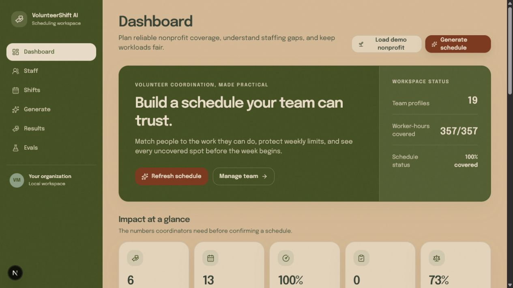
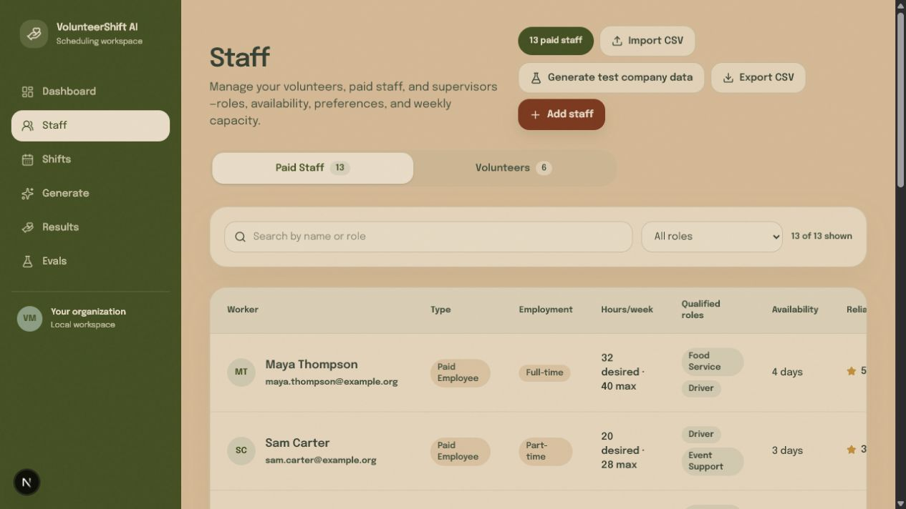
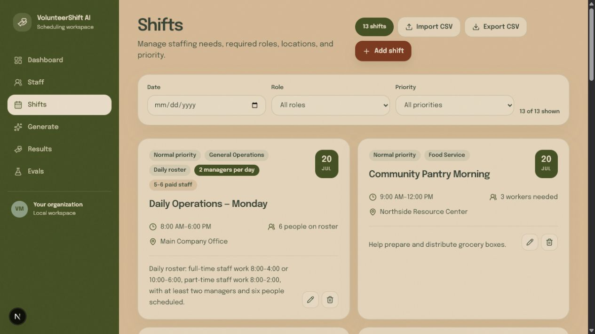
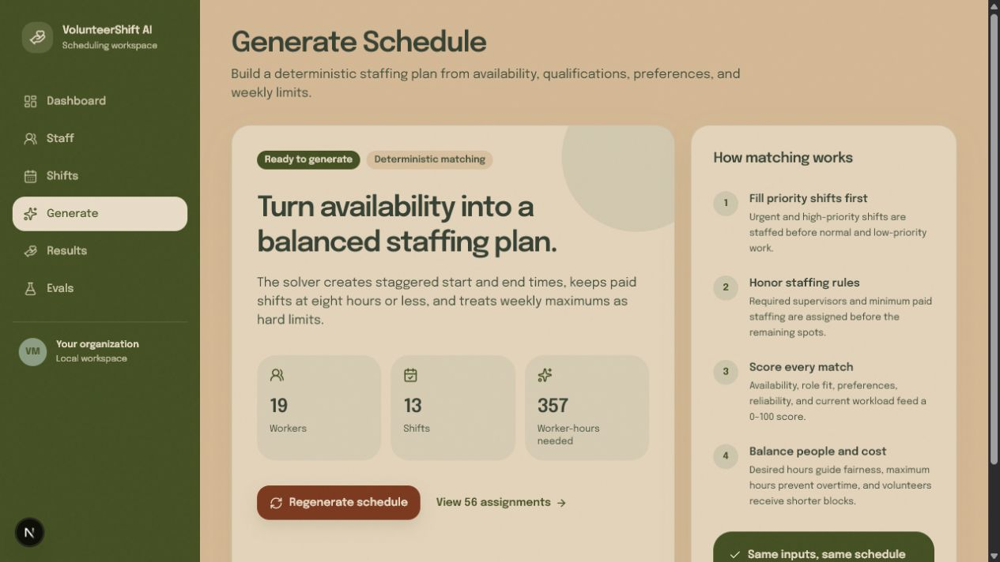
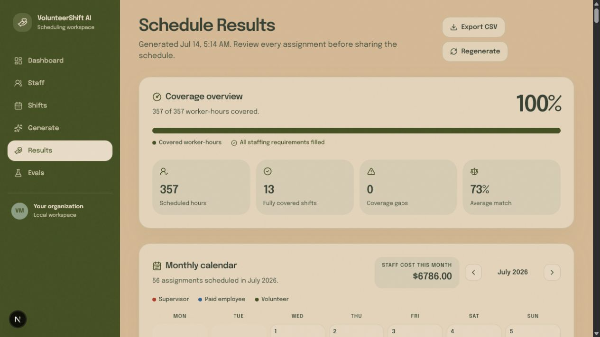

# VolunteerShift AI

**A nonprofit staffing scheduler for volunteers, paid employees, and supervisors.**
Build a fair, fully-covered, cost-aware weekly schedule in a few clicks — with an AI planner backed by a transparent safety engine you can explain to your board.


> 🚧 **Work in progress** — this project is under active development and will keep changing.
> It's **free to use, fork, and modify** for any purpose. See [License](#license).

> ⚠️ **Early-access warning:** the app is usable for experimentation and small internal pilots, but it has not been tested enough to recommend for production staffing decisions. Use it at your own risk, verify every generated schedule manually, and keep a separate backup of your roster and shifts. Never rely on it as the only source of truth for payroll, safety, compliance, or emergency coverage.

---

## ⬇️ Download & install

### Windows (installer)

1. Open the [**latest release**](https://github.com/HeroicSwan/volunteershift-ai/releases/latest) and download **`VolunteerShift.AI.Setup.0.1.0.exe`**.
2. Double-click it. It's a **one-click installer** — no admin rights needed — that adds Start-Menu and desktop shortcuts and opens the app when it finishes.
3. **First launch:** because the app isn't code-signed yet, Windows SmartScreen may say *"Windows protected your PC."* Click **More info → Run anyway**. This is normal for new indie apps and only happens once.

The desktop app runs **completely offline** in its own window — no browser, no account, no internet required. Your data stays on your computer.

### macOS & Linux

Prebuilt downloads aren't posted yet. You can build one on that machine — see [Desktop app](#desktop-app-windows--macos--linux) (`npm run dist:mac` or `npm run dist:linux`).

### Prefer to run it in a browser?

Run it locally with Node.js (see [Getting started](#getting-started)), or deploy it to any Next.js host.

---

## What is VolunteerShift AI?

VolunteerShift AI is a **weekly scheduling tool for organizations that run on a mix of volunteers and paid staff** — food banks, shelters, community events, clinics, faith groups, and any nonprofit that has to work out *who covers which shift this week.* It replaces the fragile spreadsheet with a tool that fills the schedule for you, fairly and cheaply, and can explain every choice.

You give it two things:

- **Your team** — each person's qualified role(s), their weekly availability (by day and time block), preferred days/roles, a reliability score, weekly shift/hour limits, and (for paid people) an hourly rate. Everyone is one of three types: **Volunteers**, **Paid Employees**, or **Supervisors / Leads**.
- **Your shifts** — when and where help is needed, which role, how many people, a priority (Low → Urgent), and any rules such as *requires a supervisor* or *at least N paid staff.*

Press **Generate**, and it produces a complete weekly schedule that:

- **Covers every shift** it possibly can, staffing urgent and hard-to-fill work first
- **Respects the rules** — role fit, availability, weekly shift/hour limits, no double-booking, required supervisors, and minimum/maximum paid staffing
- **Keeps costs down** — once coverage is safe, it fills routine work with free volunteers and spends paid hours only where a rule or a shortage requires it
- **Explains itself** — every assignment shows a 0–100 match score with plain-language reasons and warnings. AI proposes the plan, while deterministic hard-constraint validation prevents unsafe assignments from being saved.

Everything runs on your own device — **no account, no server, no database.** Your data is stored locally on your machine.

### Who it's for

Volunteer coordinators, shift managers, and small-team leads who currently juggle a spreadsheet and want a faster, fairer, more transparent way to staff the week — without paying for heavyweight enterprise workforce software.

## Pages

| Page | What it does |
|------|--------------|
| **Dashboard** | At-a-glance overview: team size, worker-hours needed, current coverage %, uncovered shifts, and weekly staffing demand. Load the demo workspace or jump straight to generating a schedule. |
| **Staff** | Manage everyone on your team — volunteers, paid employees, and supervisors. Set roles, weekly availability by day/time block, preferred days & roles, reliability score, hourly rate (paid only), and weekly limits. Filter by type or role, and import/export as CSV. |
| **Shifts** | Define each shift: date, time, location, required role, how many workers, priority, whether it **requires a supervisor**, and **min/max paid staff**. Import/export as CSV. |
| **Generate** | Ask the AI planner to build the schedule, validate it against hard rules, and take you to the results. |
| **Results** | The heart of the app — a monthly **calendar** (supervisors in red, paid staff in blue, volunteers in green, with names and times), plus **coverage %**, **estimated labor cost**, **staffing mix**, **fairness stats**, a **risk panel** flagging any at-risk shifts, and a per-assignment breakdown of match scores and reasons. Export the whole schedule to CSV. |

## How the scheduler works

The AI planner proposes a schedule from the full roster and shift context. The deterministic safety engine then validates availability, roles, overlaps, worker types, hours, coverage, and fairness constraints. When no API key is configured or the AI response is unsafe, the deterministic engine generates the fallback schedule.

1. **Hardest shifts first** — urgent/high-priority and scarce, hard-to-fill shifts are staffed before easy ones.
2. **Rules before headcount** — each shift assigns its required supervisor and minimum paid staff *before* filling remaining spots.
3. **Scored matching** — every eligible worker gets a 0–100 score from availability, role fit, preferred days/roles, reliability, and current workload.
4. **Coverage first, then cost** — the engine maximizes covered worker-hours, and only *after* coverage is settled does it minimize labor cost (free volunteers for routine work, paid staff kept for urgent/hard-to-fill shifts and rule requirements).
5. **Repair & rebalance** — a repair pass rescues any coverable gaps and a rebalance pass smooths out overloaded people.

## What it measures

- **Coverage** — covered vs. required worker-hours, plus uncovered and partially-covered shifts
- **Estimated labor cost** — paid hours × rate, per shift and for the whole schedule (volunteers are free)
- **Staffing mix** — how many supervisors / paid employees / volunteers, and whether supervisor and paid-minimum rules are met
- **Fairness** — assigned shifts and hours per person, with utilization against each person's limits
- **Risk** — every shift graded low / medium / high / critical, with the reasons why

## CSV import & export

Bring your existing data in and take schedules out:

- **Import** workers or shifts from CSV, with row-by-row validation, a preview before committing, and clear error messages
- **Export** workers, shifts, or the generated schedule to CSV
- Downloadable **sample templates** so the expected format is obvious

## Tech stack

- [Next.js 16](https://nextjs.org/) (App Router) + [React 19](https://react.dev/)
- [TypeScript](https://www.typescriptlang.org/) (strict)
- [Tailwind CSS 4](https://tailwindcss.com/)
- [React Hook Form](https://react-hook-form.com/) + [Zod](https://zod.dev/) for forms & validation
- [Radix UI](https://www.radix-ui.com/) primitives, [lucide-react](https://lucide.dev/) icons
- [Vitest](https://vitest.dev/) for the scheduler, CSV, and AI-summary test suites

## Getting started from a clean PC

This is the complete setup for a computer with no project tools installed. It requires Node.js 20 or newer and Git.

1. Install [Node.js 20 LTS or newer](https://nodejs.org/). Close and reopen your terminal after installation.
2. Install [Git](https://git-scm.com/downloads) if it is not already installed.
3. Clone this repository and enter the project folder:

```bash
git clone https://github.com/HeroicSwan/volunteershift-ai.git
cd volunteershift-ai
```

4. Install the exact locked dependencies and start the development server:

```bash
npm ci

npm run dev
```

5. Open [http://localhost:3000](http://localhost:3000), click **Load demo nonprofit** to populate sample data, review Staff and Shifts, then click **Generate schedule**. Treat the output as a draft and manually verify coverage, roles, hours, and conflicts.

If port 3000 is already in use, start on another port with `npm run dev -- -p 3020` and open [http://localhost:3020](http://localhost:3020).

The app stores data in browser or desktop localStorage. Export your data before experimenting, clearing site data, switching browsers, or reinstalling the desktop app.

### Run, test, and build

```bash
npm run dev              # development server
npm run typecheck        # strict TypeScript check
npm run lint             # lint
npm test                 # unit and regression tests
npm run eval             # 29 deterministic scheduler evaluations
npm run build            # production build
npm run start            # serve the production build
```

The adversarial suite is available with `npm run eval:adversarial`, but it currently exposes two documented large-scale timeout profiles and is not the normal release gate. Passing automated checks does not mean the scheduler is safe for your organization; review every result yourself.

## Reliability and evaluations

The production scheduler is exercised directly—the evaluation harness does not contain a second or simplified scheduling implementation.

```bash
npm test                 # 63 unit and regression tests
npm run eval             # 29 deterministic contract scenarios
npm run eval:adversarial # manual deep reliability and scale suite
```

The latest verified run passed all 115 hand-authored adversarial scenarios, 1,000 seeded property schedules, 23 hostile-input checks, and 20/20 validator mutations. The standard suite, typecheck, lint, and production build also pass.

The full adversarial command intentionally returns a nonzero exit code while two scale limits remain visible: 250 workers / 1,000 shifts exceeds its 30-second process budget, and 500 workers / 2,000 shifts exceeds 45 seconds. Small and ordinary nonprofit schedules remain fully covered by the exhaustive repair and fairness passes; large workloads use bounded work. Runtime results are machine-dependent. See [EVALUATIONS.md](EVALUATIONS.md) and the concise reports in [`evals/reports`](evals/reports).

## Configuration (optional)

The Generate and Results pages can use an AI planner and AI-written summary. It's **entirely optional** — without a key, the deterministic safety scheduler and built-in assistant keep the app usable offline. To enable the AI version, copy `.env.example` to `.env.local` and add your own OpenAI-compatible key:

```bash
OPENAI_API_KEY=your-key-here
OPENAI_BASE_URL=https://api.openai.com/v1
OPENAI_MODEL=gpt-5.4-mini
```

> AI is used to propose assignments and write the optional recap. Every proposed assignment still passes through the deterministic safety engine, and the app falls back to deterministic scheduling when the AI service is unavailable.

## Desktop app (Windows / macOS / Linux)

VolunteerShift AI also ships as a native desktop app built with [Electron](https://www.electronjs.org/) — a fully offline static build served inside a branded window, no server or browser required.

```bash
npm run icons        # regenerate brand icons from build/icon.svg
npm run dist:win     # Windows installer (.exe)   → dist/
npm run dist:mac     # macOS installer (.dmg)      → run on macOS
npm run dist:linux   # Linux AppImage              → run on Linux
```

The result is a clean one-click installer branded with the app icon. Built installers land in `dist/` (git-ignored) — publish them via **GitHub Releases** rather than committing them. To run the desktop shell against the live dev server while developing:

```bash
npm run dev                                                    # terminal 1
set ELECTRON_START_URL=http://localhost:3000 && npm run desktop  # terminal 2 (Windows)
```

## Project structure

```
src/
  app/            # routes: dashboard, staff, shifts, generate, results, api
  components/     # UI, forms, dialogs, calendar, CSV import, results sections
  lib/
    scheduler.ts  # deterministic safety validation, repair, and fallback (+ tests)
    csv.ts        # CSV parsing, validation, export (+ tests)
    ai.ts         # optional AI summary with offline fallback (+ tests)
    ai-scheduler.ts # AI schedule proposals with deterministic safety validation
    storage.ts    # localStorage persistence & migration
    sample-data.ts# the demo nonprofit workspace
  types/          # shared TypeScript types
```

## Screenshots

| Dashboard | Staff | Shifts |
| --- | --- | --- |
|  |  |  |

| Generate | Results & calendar |
| --- | --- |
|  |  |

## License

Released under the **MIT License** — you're free to use, copy, modify, and distribute this project, including for commercial use. See [`LICENSE`](LICENSE) for the full text.

---

Built with [Claude Code](https://claude.com/claude-code).
